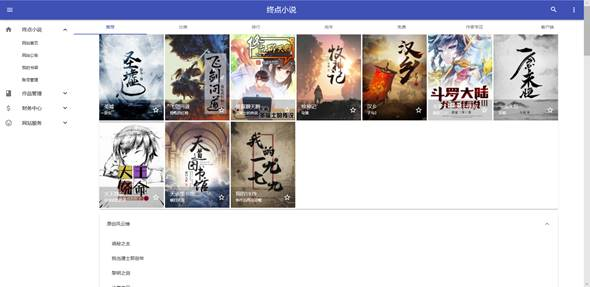
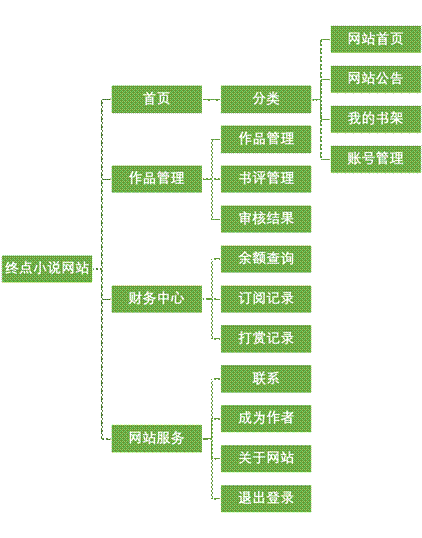
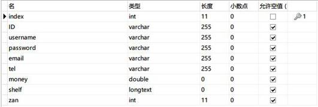
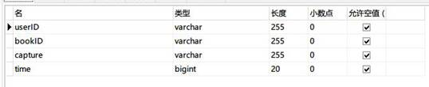
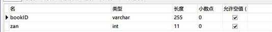
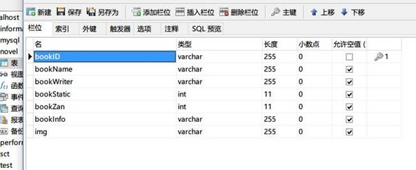
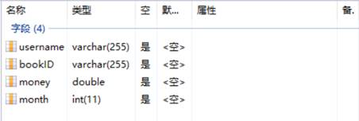
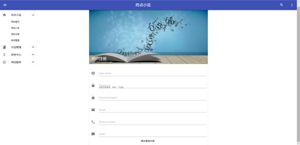
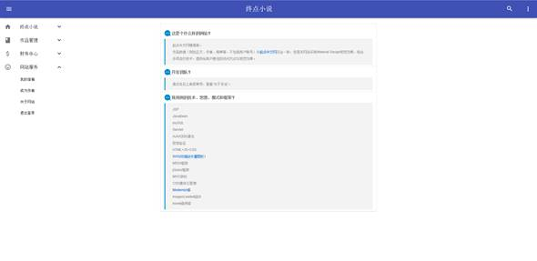
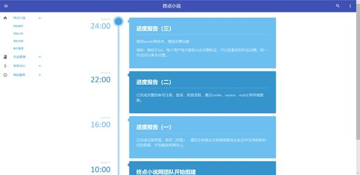

# 终点小说网

唔，这个是 J2EE 的课程设计……

纯 JSP，无后端框架。

## 功能

首页从起点中文网中抓取小说数据（封面、书名、作者、简介等），以及各类榜单。

简单的注册登录功能，包括滑动滑块发送短信验证（收费）。

发表作品，显示作品，审核作品（假）功能。

其余一些小细节。

## 数据库设计

数据库共有以下数据表：

1. 用户表（users）

   主要用来保存用户的信息。该表的字段有索引、用户的id号、账号、密码、邮箱、手机、余额、书架、剩余点赞次数（总共每天10次）。其表结构如表1所示

   

2. 分类统计表（sortcount）

   主要用来保存小说的分类信息。该表的字段有分类类别、阅读次数。其表结构如表2所示

   

3. 书架表（shelfs）

   主要用来保存用户的收藏小说信息。该表的字段有用户、书架、小说点击次数、小说的点赞次数。其表结构如表3所示

   

4. 作品点赞表（zans）

   主要用来作品被点赞的信息。该表的字段有小说id号、点赞数量。其表结构如表4所示

   

5. 作品信息表（novels）

   主要用来存放作品的主要信息。其表结构如表5所示

   

6. 打赏表（hitmoney）

   主要用来存放用户打赏记录的信息。该表的字段有用户名、小说id号、打赏金额、打赏时间。其表结构如表6所示

   

## 界面

1. 用户注册

   功能：用户注册。文件register.jsp为用户注册时的页面。页面如图所示

   

 

2. 用户登录

   文件login.jsp为用户登陆的页面。页面如图所示

   

3. 首页：

4. 公告与帮助页：

## 开发环境

- JSPStudy（必须，否则可能会有版本问题）
- Sublime Text3
- JDK（取自E4A，用来编译成JSPStudy对应版本的class）

## 开发团队

网站信息上有。